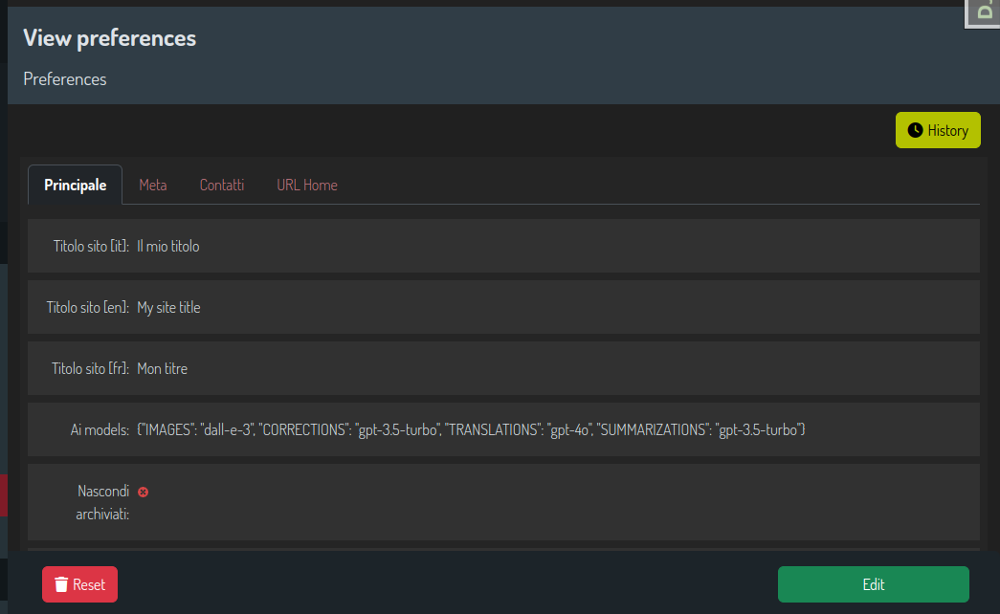

# Django Preferences Utils


[](https://travis-ci.com/github/otto-torino/django-preferences-utils)

[](https://pepy.tech/project/django-preferences-utils)



All you need to manage your django project preferences.

## Motivation

So you need to manage your django project preferences.    
You tried many different solutions bu no one seemed to work well.    
And then you came across this one.     
Let's talk about it.    

There is nothing special about managing preferences in Django. A simple model is everything you need.    
The problem is that you just need one record, isn't it?   
And you don't want to have an ugly changelist view with just one row.   
Nothing special, you can solve it, but it's boring.

So here comes Django Preferences Utils.

**You define your preferences in a model, use everything you want: file fields, image fields, json fields, translations, everything.
Just make sure to subclass what you have to as explained below, register your model and you're done. All the other stuff is taken care of by Django Preferences Utils.**

**Oh, and you can also define multiple models for your preferences.**

## How to

Install Django Preferences Utils

``` bash 
$ pip install django-preferences-utils
```

Add it to your `INSTALLED_APPS`:

``` python 
    INSTALLED_APPS = (
        ...
        'django_preferences_utils',
        ...
    )
```

Create your preferences model:

``` python
from django.db import models
from preferences_utils.models import PreferencesUtilsModel

# "pref" is the name used internally to ref this particular model
# and is also the key used by the context processor and accessible in all your templates
@PreferencesUtilsModel.register("pref")
class Preferences(PreferencesUtilsModel):
    site_title = models.CharField(_('site title'), max_length=100, default="The best site in the world", blank=True)

    class Meta:
        verbose_name = _("site settings")
```

> Important: Django Preferences Utils will save your model by itself when requiring a preferences instance. So be sure to have only nullable fields or fields with a default value.

Now probably you want to register you model in the admin:

``` python
from django.contrib import admin
from preferences_utils.admin import PreferencesUtilsAdmin
from .models import Preferences

@admin.register(Preferences)
class PreferencesNewAdmin(PreferencesUtilsAdmin):
    list_display = ('id', 'site_title', ) # whatever, is never shown

    fieldsets = (
        (_('Main'), {
            'fields': ("site_title",),
            "classes": ("baton-tabs-init",), # django-baton, you should use it ;)
        }),
    )
```

And propbably you need to use your preferences...

Inside a view:

``` python 
from django.views.generic import View
from .models import Preferences

class MyView(View):
    pref = Preferences.instance()
    # or PreferencesUtilsModel.instance("pref")
    # ...
```

Or inside a template, in this case add to your context processors in your settings:

``` python
TEMPLATES = [
    # ...
    "OPTIONS": {
        # ...
        "context_processors": [
            # ...
            # notice the "pref" part at the end, this is the name used when registering your model
            "preferences_utils.context_processors.preferences.pref",
        ],
    }
]
```

And now you can use your preferences in your templates.

``` html 
    <h1>{{ pref.site_title }}</h1>
```

## How it works

Django Preferences Utils provides a few things:

- A model to subclass which assures you have only one instance in your database
- The same model class provides a class method to retrieve the instance
- Registering your model to Django Preferences Utils allows you to have multiple preferences models and customize the name used in the context
- An admin model to subclass which provides a custom changelist view
- A context processor to retrieve your preferences

## Running Tests

Does the code actually work?

``` bash
$ source <YOURVIRTUALENV>/bin/activate
(myenv) $ pip install -r requirements_test.txt
(myenv) $ python runtests.py
```


## Development commands

``` bash
pip install -r requirements_dev.txt
invoke -l
```

## Credits

Django Preferences Utils is developed by Otto SRL.
